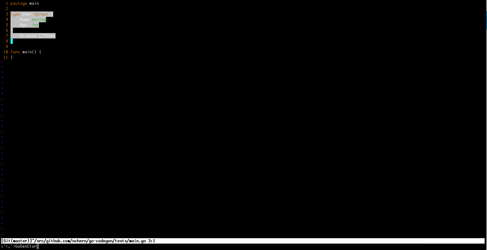
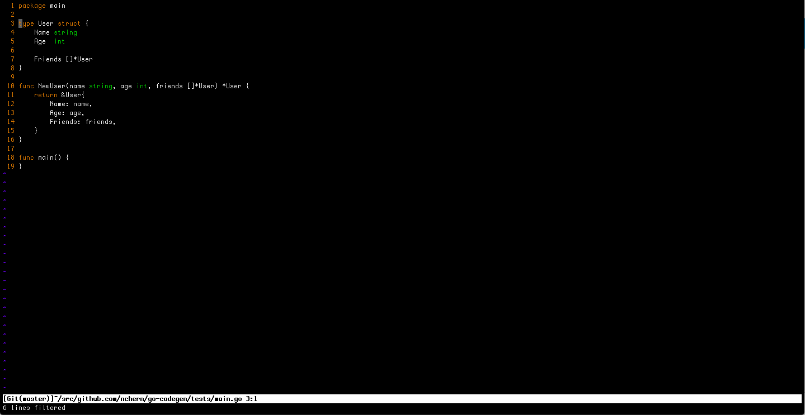

## constructor command

Generates constructor function for a struct.

### Command line

Let's suppose we have a go file with structs defined:

```bash
$ cat user.go 
package main

type User struct {
	Name string
	Age  int

	HomeAddress *Address
}

type Address struct {
	City   string
	Street string
}
```

Now can generate constructor functions for them:

```bash
$ cat user.go | go-codegen constructor
func NewUser(name string, age int, homeAddress *Address) *User {
	return &User{
		Name: name,
		Age: age,
		HomeAddress: homeAddress,
	}
}
func NewAddress(city string, street string) *Address {
	return &Address{
		City: city,
		Street: street,
	}
}
```

### Vim integration

It could be more convenient to use this generator from your favourite text editor. Here is an example how to integrate it with Vim.
Just add the following line to your `~/.vimrc`:

```vim
autocmd FileType go command! -range=% GoGenCtor :<line1>,<line2>!go-codegen constructor -s
```

Now you can select the struct in VISUAL mode and run the command `:GoGenCtor` to generate constructor for it:




